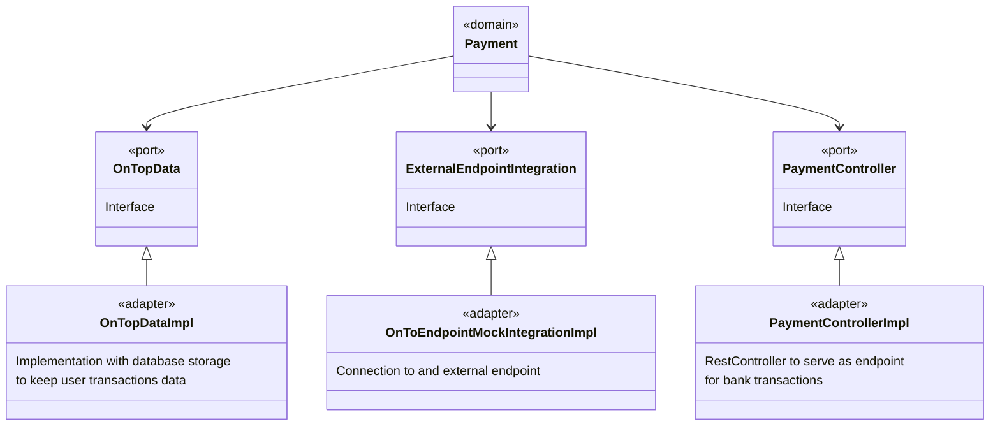
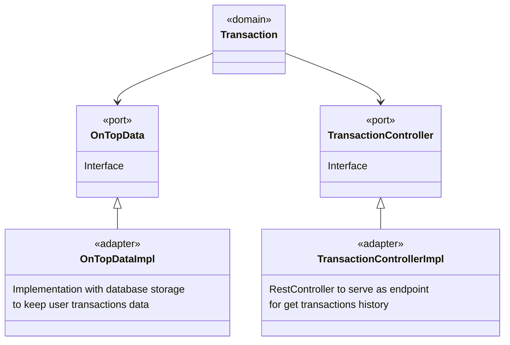
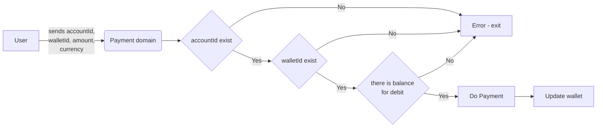
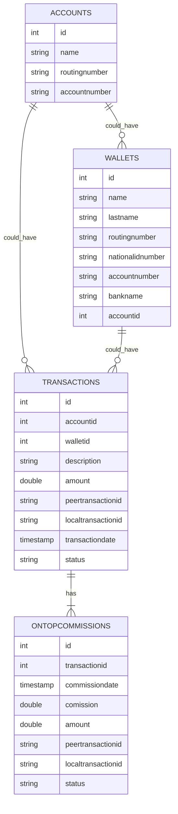

# ABOUT THE TECHNICAL TEST

Please review the documentation contained in the "Ontop’s Challenge for backend with Java (English)" PDF file

# SOLUTION DESIGN

There are two actors identified in this code challenge: USERr who is the client of ONTOP and ONTOP who also has shares in the software  

##USER use cases


**Add bank account:** the User add its bank account details in order to do money transfers with ONTOP. This data must be stred in some place

**Transfer money:** The user transfers money from his wallet to his bank account. This operation has to consult if there are funds for transfer in the user's wallet (it uses an external webservice for this purpose), then it uses an external web service for money transfer and finales uses an other web service to update wallet balance. Not all bank transactions are sucessfully, so there must be an trasfer status for comision discount or for rever the transaction  

**Consult bank data:** This is used by the "Transfer money case", the idea is not to ask all bank data every time a transaction is going to be made. 

**View transactions:** All transactions must be stored in some place for reporting purposes

##ONTOP use cases


**Debit 10% per transaction:** When a transaction is done, ONTOP gets 10% of it. These are the posible scenarios:
* A transaction is done with status "Processing". the comision is billed but it stays with IN_PROGRESS status. The transaction information is saved for tracking purposes  
* A transaction is done with status "Success". the comision is billed with COMPLETED status. The transaction information is saved for tracking purposes.
* A transaction is failed. No comision is billed. The transaction information is saved for tracking purposes

**Update transaction status:** The system looks for pending transactions (status = IN_PROGRESS) and uses a webservice to consult the transaction status. These are the posible scenarios:
* The transaction change its status to "Success", then the ONTOP transaction record must be updated to COMPLETED
* The transaction change its status to "Failed", then the ONTOP transaction record must be updated to FAILED and the transaction must be reverted (money returns to the user wallet without comision billed)

**Update USER wallet balance** Update this data accordinf the sucessfull, pending, failed and reverted transactions

##Hexagonal architecture

We have identified 3 domains: Payments, transactions and wallets
the domains interact with different data providers:
1. A mock which works as an endpoint to all related with the user wallet and data transfers
2. A data store provider whose type is unknown (NoSQL, SQL, etc) and we also don't know the design of the data model.

Bearing in mind that the mock could be changed to a real solution and that the data store could be anything, the best aproach is to use the port - adapter pattern.

##Wallet 


##Payment 


##Transaction 



##Payment flowchart

The payment operation is the most complex of this entire project, since it interacts with several points, it must calculate the commission and it must also be persisted in the database.



##Status codes

The following codes are saved with the transaction record according its posible scenarios.
* `COMPLETED`: The Ontop Mock server responses with a sucessfull status, then the transaction is complete.
* `IN_PROGRESS`:  The Ontop Mock server responses with a "Processing" status. that means that the transaction in not completed yet, and is needed some kind of process to verify the transaction status later in order to have inal response.
* `FAILED`: This only happens when the transaction was with status "IN_PROGRESS" and after verify the transaction status, it failed. Then, the record is updated to this state. 
* `REFUNDED`: After the transaction is FAILED, then the money is refunded and a record is created with this status 


##Webservices to be implemented

**1. SAVING BANK ACCOUNT DETAILS**
It is going to be used to storage user's bank account.
**Endpoint:** /api/v1/banks
**Http method:** POST
**Payload (JSON):** 
```json
      {
          "walletid": 1,
          "firstname": "Felipe",
          "lastname": "Diaz C",
          "routingnumber": "211927207",
          "nationalidnumber": "9445386"
          "accountnumber": "AA000001",
          "bankname": "this is my bank's name"
      } 
```
All the fileds within the payload are mandatory.
* `walletid`: Is the ID used to locate user's wallet.

**Responses:**
* Http status code 200: OK
```json
      {
          "walletid": 1,
          "message": "DONE",
      } 
```
* Http status code 4xx: Bad Request / Code 5xx: Internal server error
```json
      {
          "code": "GENERIC_ERROR",
          "message": "something bad happened"
      }
```
Use codes BAD_REQUEST for status 400 and UNKNOW_ERROR for status 5xx and give a brief descripton about what happened on the message field.

**2. PAYMENTS**
It is going to be used to transfer money from ONTOP's bank account to a user bank account.
**Endpoint:** /api/v1/payments
**Http method:** POST
**Payload (JSON):** 
```json
      {
        "accountId": 1,
        "walletId": 1,
        "amount": 20.0,
        "currency": "USD"
      } 
```
All the fileds within the payload are mandatory.
* `accountid`: Is the ID used to locate ONTOP's bank account record.
* `walletid`: Is the ID used to locate user's wallet.
* `amount`: Amount of money to be transfer
* `currency`: The currency that is going to be used

**Responses:**
* Http status code 200: OK
```json
      {
          "requestInfo": {
              "status": "Processing"
          },
          "paymentInfo": {
              "amount": 20.0,
              "id": "aca71db4-4f3d-486e-baab-b9bc325b097c"
          }
      }
```
The response is the same than the one returned by the ONTOP's mock server on a sucessfully operation.

The trnsaction record is saved ussing on of the following status code according the response received by the ONTOP Mock server: COMPLETED / IN_PROGRESS

* Http status code 4xx: Bad Request / Code 5xx: Internal server error
```json
      {
          "timestamp": "2023-04-04T11:01:10.052+00:00",
          "message": "body is invalid, check postman collection example",
          "details": "uri=/api/v1/payments",
          "localTransactionId": "0c38477e-6316-4088-80ae-49ea52574b92"
      }
```
* `timestamp`: Date and hour of the transaction
* `message`: Brief descripton about what happened
* `details`: The URL that was called and generated the error
* `localTransactionId`: Unique local ID to identify the transaction into the application logs

**3. TRANSACTIONS HISTORY**
It is going to be used to query the transactions ordered by descending “creation date” in a paginated way and filtered by amount and date.

**Endpoint:** /api/v1/transactions
**Http method:** GET
**Parameters:** 
* `page`: Desired page number (default is 1. this parameter is optional)
* `size`: Maximum number of transactions per page (default is 10. this parameter is optional)
* `walletid`: Is the ID used to locate user's wallet and transaction history (mandatory)
* `startdate`: Start date to filter transactions (mandatory)
* `enddate`: End date to filter transactions (mandatory)
* `amount`: filter the transactions matching this transfer amount (optional)


Example:

```
GET /api/v1/transactions?page=1&size=10&walletid=2&startdate=2023-01-01&enddate=2023-03-30
```

**Responses:**
* Http status code 200: OK
```json
      {
        "total": 10000,
        "page": 1,
        "limit": 10,
        "transactions": [
          {
            "transactionid": 1,
            "accountid": 1,
            "walletid": 2,
            "amount": 18.0,
            "transactiondate": "2023-04-04 10:58:29.32",
            "description": "Bank transfer to your account",
            "status": "IN_PROGRESS"
          },
          ...
        ]
      }
```
* `total`: Total number of transactions
* `page`: Current page number
* `limit`: Maximum number of transactions per page
* `transactionid`: 1,
* `accountid`: Is the ID of the ONTOP's bank account (the one which made the transfer).
* `walletid`: Is the ID of the user's wallet (the one which received the transfer).
* `amount`: The amount transfered,
* `transactiondate`: date and time of the transaction,
* `description`: brief transaction description,
* `status`: one of COMPLETED / REFUNDED / FAILED / IN_PROGRESS

* Http status code 400 Bad Request: If any of the query parameters are invalid.
```json
      {
          "timestamp": "2023-04-04T11:01:10.052+00:00",
          "message": "Parameters are invalid",
          "details": "uri=/api/v1/transactions",
      }
```
* 404 Not Found: If no transactions are found for the requested made.
```json
      {
          "timestamp": "2023-04-04T11:01:10.052+00:00",
          "message": "No records found",
          "details": "uri=/api/v1/transactions",
      }
```
* 500 Internal Server Error
```json
      {
          "timestamp": "2023-04-04T11:01:10.052+00:00",
          "message": "Error on server, please review the log file",
          "details": "uri=/api/v1/transactions",
      }
```

##Database model



##Data dictionary

| Field                    | description                                              |
|--------------------------|----------------------------------------------------------|
| id                       | Primary key of the table                                |
| ACCOUNTS.name            | Owner of the account                                     |
| routingnumber            | Bank routing number                                      |
| accountnumber            | Bank account number                                      |
| WALLETS.name             | Name of the wallet's owner                               |
| WALLETS.lastname         | Lastname of the wallet's owner                           |
| nationalidnumber         | National ID card number                                  |
| bankname                 | Bank name                                                |
| accountid                | Foreign key. Id of the ACCOUNTS table                    |
| walletid                 | Foreign key. Id of the WALLETS table                     |
| TRANSACTIONS.description | Brief description of the transaction                     |
| TRANSACTIONS.amount      | Amount of money (the original amount - ontop comission)  |
| peertransactionid        | Id of the transaction gotten from the ONTOP mock server  |
| localtransactionid       | Local Id of the transaction                              |
| transactiondate          | transaction date and time                                |
| status                   | one of COMPLETED / REFUNDED / FAILED / IN_PROGRESS       |
| commissiondate           | ONTOP commission date and time                           |
| commission               | amount of money. Is the ONTOP commission per transaction |
| ONTOPCOMMISIONS.amount   | Amount of money (the original amount)                    |


##Considerations regarding the connection with the Mocks endpoints

Because the system depends on an external system, it may be susceptible to failure and therefore recovery mechanisms must be in place in this case. All The connections with external endpoints must have:

1. Timeout: the connection timeout must be defined and this must be configurable (ex. webClientTimeout=5000 for 5s)
2. Retrys: There should be retries after a timeout occurs and this should be configurable (ex. webClientRetry=3 for 3 retrys)

##Considerations regarding the logs

Because the payments endpoint invokes 3 external endpoints and persistence operations in the database, there is the possibility that at some point there is an error and the resulting operation is not consistent, these are possible scenarios in which this can happen:

1. The external payment endpoint was executed successfully, the persistence operation with the database failed. Due to this the endpoint to update the wallet was not executed.

2. The external payment endpoint was executed successfully, the persistence operation with the database was executed successfully but the endpoint to update the wallet failed.

To recover these failures, each of the steps that make up the payment operation must be recorded in a log and must have a unique identifier that allows tracking a transaction. In this way, in case of failures, the transaction can be identified, where it failed and therefore be able to make the corresponding corrective measures.

##What is missing? What would I have wanted to do but didn't do due to lack of time?

1. Fix the data model, allow a wallet user to have several bank accounts to which they can transfer their money.

2. To complete the integration tests with external endpoints. The tests regarding timeouts and retrys are missing.

3. Fix the data model regarding the banking information of the wallets. This information is PII (personally identifiable information) therefore it should be crypted. One way to fix this is to just have two fields in the WALLETS table: id and data, and in the data field saving an encrypted JSON with the bank information