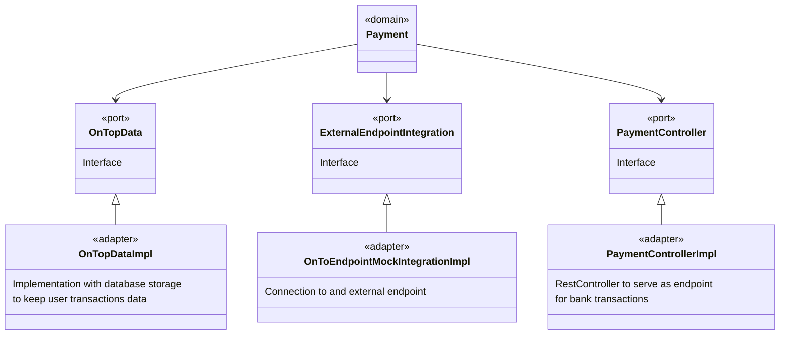
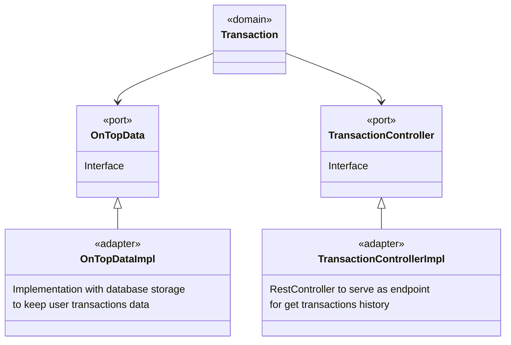
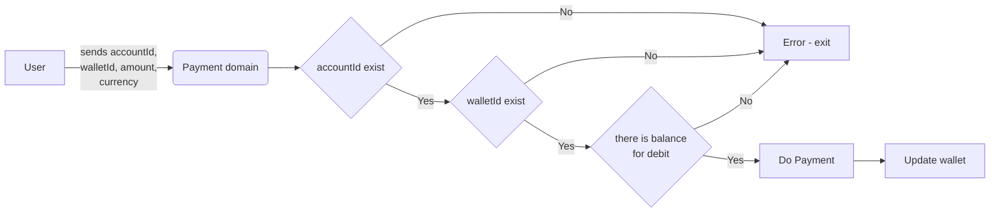
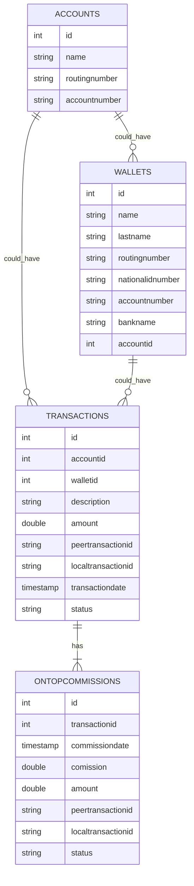

# ABOUT THE TECHNICAL TEST

Please review the documentation contained in the "Ontop’s Challenge for backend with Java (English)" PDF file

# SOLUTION DESIGN

There are two actors identified in this code challenge: USERr who is the client of ONTOP and ONTOP who also has shares in the software  

##USER use cases

**Add bank account:** the User add its bank account details in order to do money transfers with ONTOP. This data must be stred in some place

**Transfer money:** The user transfers money from his wallet to his bank account. This operation has to consult if there are funds for transfer in the user's wallet (it uses an external webservice for this purpose), then it uses an external web service for money transfer and finales uses an other web service to update wallet balance. Not all bank transactions are sucessfully, so there must be an trasfer status for comision discount or for rever the transaction  

**Consult bank data:** This is used by the "Transfer money case", the idea is not to ask all bank data every time a transaction is going to be made. 

**View transactions:** All transactions must be stored in some place for reporting purposes

##ONTOP use cases

**Debit 10% per transaction:** When a transaction is done, ONTOP gets 10% of it. These are the posible scenarios:
* A transaction is done with status "Processing". the comision is billed but it stays with IN_PROGRESS status. The transaction information is saved for tracking purposes  
* A transaction is done with status "Success". the comision is billed with COMPLETED status. The transaction information is saved for tracking purposes.
* A transaction is failed. No comision is billed. The transaction information is saved for tracking purposes

**Update transaction status:** The system looks for pending transactions (status = IN_PROGRESS) and uses a webservice to consult the transaction status. These are the posible scenarios:
* The transaction change its status to "Success", then the ONTOP transaction record must be updated to COMPLETED
* The transaction change its status to "Failed", then the ONTOP transaction record must be updated to FAILED and the transaction must be reverted (money returns to the user wallet without comision billed)

**Update USER wallet balance** Update this data accordinf the sucessfull, pending, failed and reverted transactions

##Hexagonal architecture

We have identified 3 domains: Payments, transactions and wallets
the domains interact with different data providers:
1. A mock which works as an endpoint to all related with the user wallet and data transfers
2. A data store provider whose type is unknown (NoSQL, SQL, etc) and we also don't know the design of the data model.

Bearing in mind that the mock could be changed to a real solution and that the data store could be anything, the best aproach is to use the port - adapter pattern.

##Wallet 

##Payment 

##Transaction 

##Payment flowchart

The payment operation is the most complex of this entire project, since it interacts with several points, it must calculate the commission and it must also be persisted in the database.

##Database model

