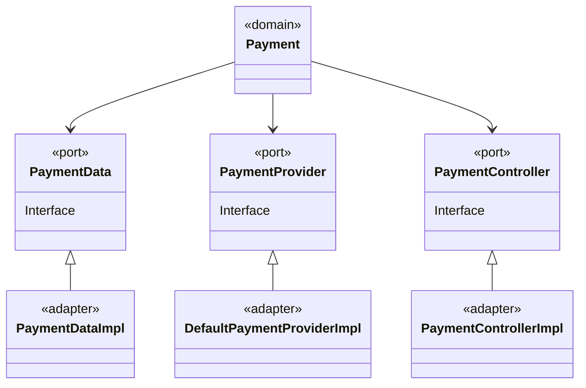

# BACKEND ENGINEER CODE CHALLENGE FOR ONTOP

* By Felipe Diaz C: [felipediazc@gmail.com](mailto:felipediazc@gmail.com)

Disclaimer: Please use a Markdown editor/viewer with mermaid support in order to have access to the ERD diagram

### SOFTWARE REQUIREMENTS

You need MAVEN 3.8.1 and JAVA 17 installed in your PC, MAC or LINUX.

### HOW TO PACKAGE

mvn clean install

### HOW TO TEST

If you want to do the unit and integration test, please use the following instruction:

mvn test

### HOW TO PACKAGE WITHOUT TESTING

mvn clean install -DskipTests

### HOW TO DOWNLOAD ALL DEPENDENCIES

mvn install dependency:copy-dependencies

## HOW TO RUN (Default port is 8080)

There is two alternatives to run de application

1. mvn spring-boot:run
2. java -jar target/rmm-0.0.1-SNAPSHOT.jar

## ENDPOINTS

http://localhost:8080/swagger-ui/index.html?configUrl=/v3/api-docs/swagger-config#/

## CODE COVERAGE

Please look into the target/site/jacoco folder for de index.html file

# ABOUT THE TECHNICAL TEST

Please review the documentation contained in the "Ontop’s Challenge for backend with Java (English)" PDF file

